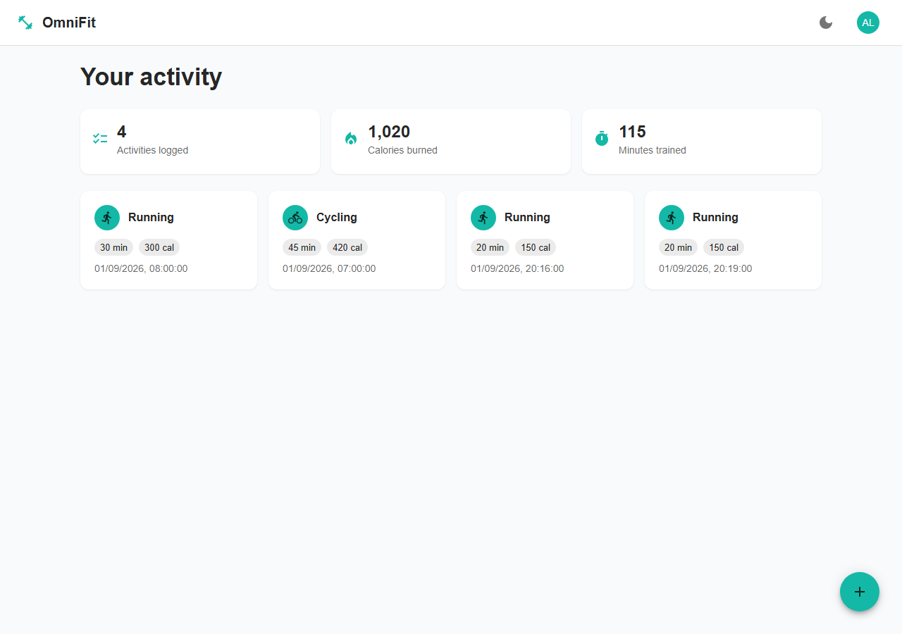
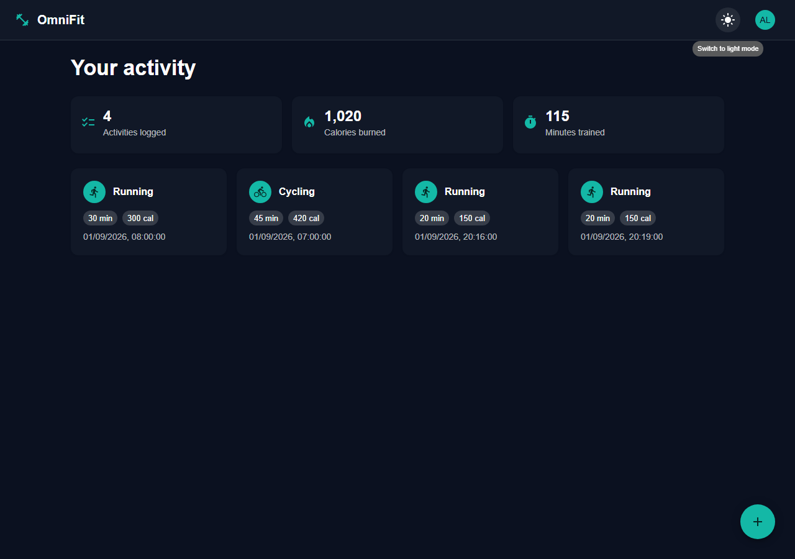
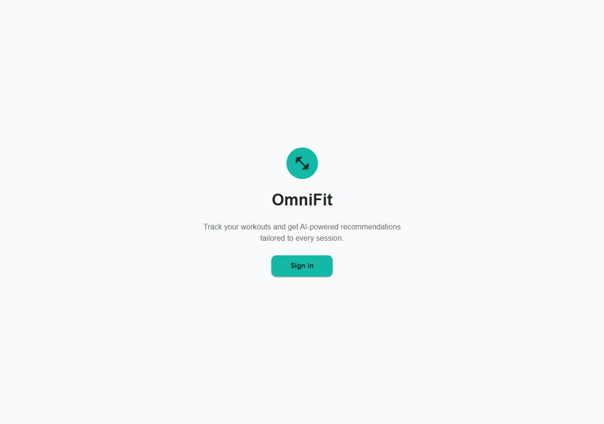
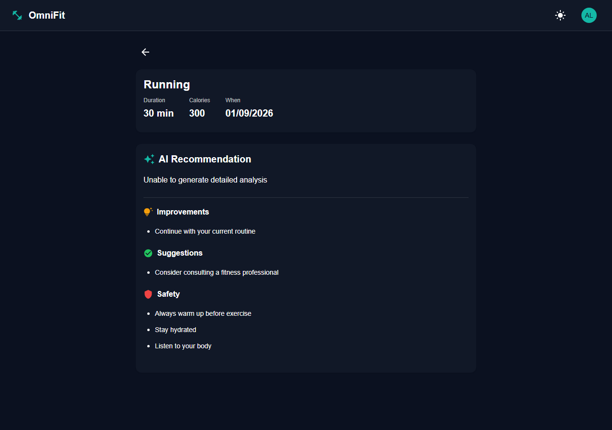

# OmniFit


A microservices fitness-tracking platform: log a workout, get an AI-generated
recommendation for it. Six Spring Boot services behind an API gateway, Keycloak for
identity, RabbitMQ carrying events between services, and a React frontend — built and
verified end to end, not just scaffolded.

## Contents

- [Screenshots](#screenshots)
- [Features](#features)
- [Architecture](#architecture)
- [Prerequisites](#prerequisites)
- [Setup](#setup)
- [Running the backend](#running-the-backend)
- [Running the frontend](#running-the-frontend)
- [Verifying it's all working](#verifying-its-all-working)
- [License](#license)

## Screenshots

| | |
|---|---|
|  |  |
|  |  |

## Features

- **OAuth2 Authorization Code + PKCE login** against Keycloak — no password ever touches
  this codebase; the frontend never sees a client secret.
- **Role-based access control** (`USER` / `ADMIN`) enforced at every layer: the gateway maps
  Keycloak roles onto Spring authorities, and every resource read is self-or-admin scoped —
  not just "are you logged in."
- **Reactive backend, genuinely** — WebFlux, `ReactiveMongoRepository`, non-blocking
  `WebClient` calls throughout activityservice and aiservice, not blocking code with a
  reactive dependency sitting unused.
- **Event-driven AI recommendations** — tracking an activity publishes to RabbitMQ;
  aiservice consumes it, calls the Gemini API, and stores a structured recommendation
  (performance analysis, improvements, next-workout suggestions, safety notes).
- **Defense in depth at the network boundary** — every backend service rejects requests
  that didn't pass through the gateway's JWT check, closing the gap where services also
  bind to `localhost` in local dev.
- **Per-user rate limiting** at the gateway, in-memory, no extra infrastructure required.

## Architecture

```
React (Vite/MUI/Redux) --PKCE login--> Keycloak (realm: fitness-oauth2)
        |
        v (JWT bearer)
   API Gateway (Spring Cloud Gateway, WebFlux)  <-- the only service exposed publicly
   - verifies the JWT (signature + expiry) against Keycloak's JWKS
   - maps Keycloak realm roles -> Spring authorities
   - rate-limits per authenticated user (in-memory, fixed window)
   - stamps a shared internal secret + X-User-ID/X-User-Roles on every proxied request
   - syncs first-seen users into userservice
   - routes lb://<service> via Eureka
        |            |              |
        v            v              v
  userservice   activityservice  aiservice
  (Postgres/JPA) (MongoDB/WebFlux) (MongoDB/WebFlux)
                       |                ^
                       +--RabbitMQ------+  (activity events -> AI recommendations, Gemini API)

  eureka (service registry) + configserver (native, config/*.yml) underpin all five app
  services; every one of them also rejects any request missing the gateway's internal
  secret, so a direct call that bypasses the gateway (and its JWT check) is refused.
```

Local dev runs everything over plain HTTP behind a single gateway instance — the rate
limiter and internal-secret check are in-memory and assume that one instance (see the
docstrings on `RateLimitGlobalFilter` and `InternalAuthHeaderFilter` for the Redis-backed /
TLS upgrade path a real deployment would need).

**Stack:** Java 23, Spring Boot 3.4.3, Spring Cloud 2024.0.0, Eureka, Spring Cloud Config,
Spring Cloud Gateway, Postgres + JPA, MongoDB + reactive Spring Data, RabbitMQ, Keycloak
(OAuth2 Authorization Code + PKCE), React 19 + Vite + MUI 6 + Redux Toolkit + react-router 7.

## Prerequisites

- Java 23, Maven
- Node 18+
- Docker Desktop (Postgres, MongoDB, RabbitMQ, Keycloak all run in containers)
- A Gemini API key ([aistudio.google.com](https://aistudio.google.com)) — only needed for `aiservice`

## Setup

```bash
cp .env.example .env
# edit .env: fill in GEMINI_API_KEY. Everything else has a working local default.

docker compose up -d
```

Wait for all four containers to report healthy (`docker compose ps`). Keycloak imports the
`fitness-oauth2` realm automatically on first start, including two seeded users:

| username | password    | role         |
|----------|-------------|--------------|
| `alice`  | `Passw0rd!` | USER         |
| `admin`  | `Passw0rd!` | ADMIN + USER |

These are local-only seed accounts defined in `docker/keycloak/realm-export.json` — the
passwords are plaintext there, which is fine for throwaway dev containers and never
something you'd do with real credentials.

## Running the backend

Build and start each service **in this order** (each needs the one before it):

```bash
# 1. Config server needs to be up before anything else fetches config from it
cd configserver && mvn clean package && java -jar target/configserver-0.0.1-SNAPSHOT.jar &
# 2. Service registry
cd eureka && mvn clean package && java -jar target/eureka-0.0.1-SNAPSHOT.jar &
# 3. Everything else - order doesn't matter between these three, but the gateway
#    needs at least one of them registered in Eureka before it can route to it
cd gateway && mvn clean package && java -jar target/gateway-0.0.1-SNAPSHOT.jar &
cd userservice && mvn clean package && java -jar target/userservice-0.0.1-SNAPSHOT.jar &
cd activityservice && mvn clean package && java -jar target/activityservice-0.0.1-SNAPSHOT.jar &
cd aiservice && mvn clean package && \
  GEMINI_API_URL="https://generativelanguage.googleapis.com/v1beta/models/gemini-3.6-flash:generateContent?key=" \
  GEMINI_API_KEY="<your key>" \
  java -jar target/aiservice-0.0.1-SNAPSHOT.jar &
```

Give it ~30-40 seconds after everything's started before hitting the gateway — Eureka
clients cache the registry and only refresh every 30s, so a service that *just* registered
can briefly look unavailable to the gateway's load balancer.

**If Gemini returns a 404 "model no longer available":** model names get retired over time.
Check what your key currently has access to with:
```bash
curl "https://generativelanguage.googleapis.com/v1beta/models?key=YOUR_KEY"
```
and swap the model segment in `GEMINI_API_URL` accordingly.

## Running the frontend

```bash
cd frontend && npm install && npm run dev
```
Opens at `http://localhost:5173`.

## Verifying it's all working

```bash
node scripts/smoke-test.mjs
```

Exercises the whole stack: token issuance, JWT verification, role mapping, unauthenticated
rejection, activity tracking, ownership enforcement (a regular user can't read another
user's data; an admin can), and the full RabbitMQ → Gemini → Mongo recommendation
pipeline. Takes up to ~90s (waiting on the AI call).

## License

[MIT](LICENSE)
